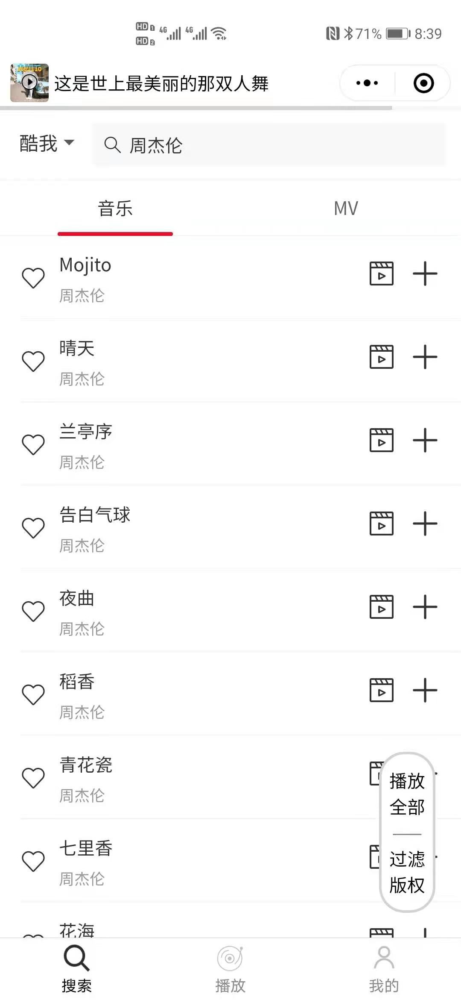
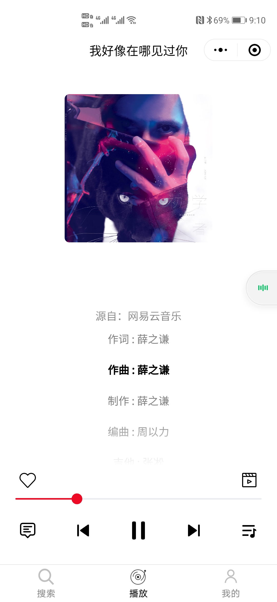
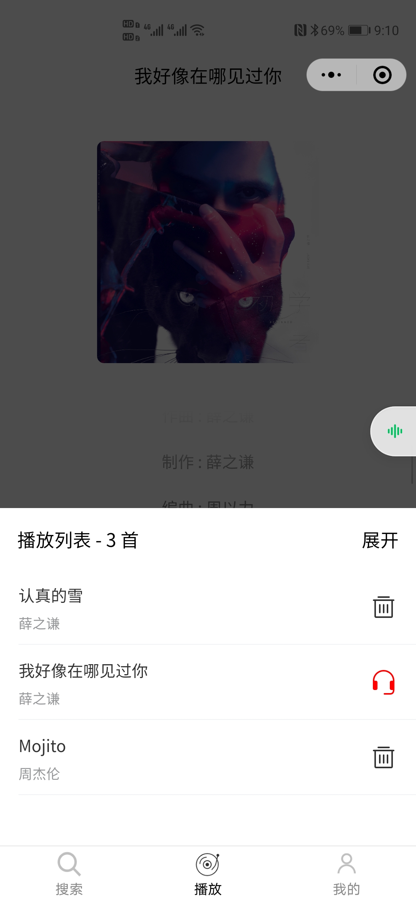
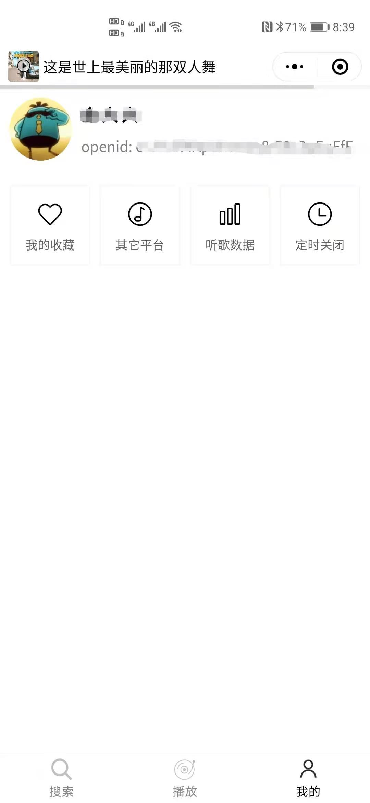
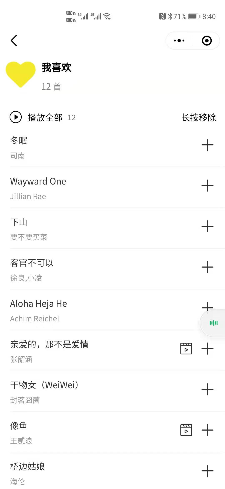

# 微信小程序练手项目 之 简约的音乐播放器
这只是一个单纯的音乐播放小程序（前端），不带后台，所以建议准备一个自己的后台用来提供音乐服务。

不过后台我也准备好了，在[这里](https://github.com/jindada1/Relaxion)

## 主界面截图

分为三个大页面

1. 搜索：选择平台，搜索音乐或者MV。
2. 播放：控制音乐的播放，查看评论，收藏该音乐。
3. 我的：查看我的个人数据、我的收藏。

### 搜索

+ 点击播放
+ 添加到播放列表
+ 播放全部
+ 过滤掉有版权限制的音乐
+ 观看MV
+ 收藏音乐

    

### 播放

+ 播放/暂停
+ 上一首/下一首
+ 查看当前的播放列表
+ 查看这首歌的评论
+ 观看MV
+ 收藏音乐
+ 上下滑动查看歌词
+ 滑动进度条调整播放进度

    

### 我的

+ 查看我的（微信号）信息
+ 进入我的收藏夹
+ 将歌曲移出收藏夹
+ 观看MV
+ 播放全部
+ 添加到播放列表

    

## 独立页面

+ 查看评论
+ 观看MV

    

